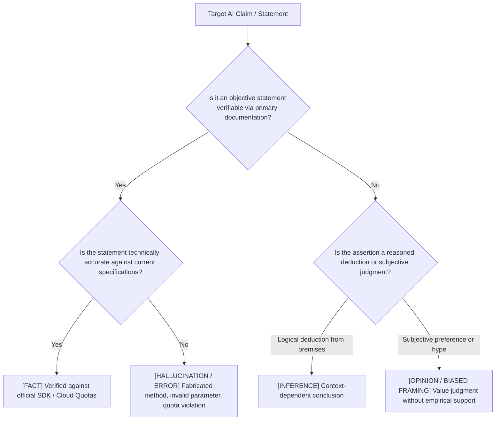

# Practical 2.1: AI Hallucination & Empirical Evidence Audit Matrix

**Module**: Module 2 - Critical Thinking  
**Level**: Associate / Graduate Trainee  
**Duration**: 45 Minutes  
**Core Technical Competencies**: Claim Categorization Taxonomy (Fact vs. Inference vs. Opinion vs. Hallucination), Fabricated API Identification, Hard Limit Compliance, Primary Source Verification Protocols.

---

## 1. Business Context & Problem Specification

In enterprise software engineering, technical teams increasingly employ AI assistants to generate architectural feasibility reports, cloud migration roadmaps, and technology evaluation memos. 

However, LLMs generate responses based on statistical token prediction rather than formal validation. They exhibit **Automation Bias** and **Fluent Output Hallucinations**—authoritatively asserting non-existent SDK parameters, outdated quotas, or ungrounded architectural generalizations.

In this laboratory, trainees act as Systems Architects conducting an empirical audit of an AI-generated cloud modernization proposal: [`ai_generated_report.md`](file:///Users/aaryankumar/Documents/promptengg/labs/02_critical_thinking/lab1_hallucination_audit/ai_generated_report.md).

---

## 2. Theoretical Framework: The Four-Tier Claim Taxonomy

1. **`[FACT]`**: Objective, empirical claims verifiable via primary documentation.
2. **`[INFERENCE]`**: Logical deductions derived from factual premises.
3. **`[OPINION / BIASED FRAMING]`**: Subjective assertions or vendor marketing claims framed as universal truths.
4. **`[HALLUCINATION / FACTUAL ERROR]`**: Non-existent SDK APIs, fabricated configuration parameters, or cloud quota limit violations.

---

## 3. Trainee Deliverables

Open [`exercise_starter.md`](file:///Users/aaryankumar/Documents/promptengg/labs/02_critical_thinking/lab1_hallucination_audit/exercise_starter.md) and execute:

1. **Phase 1: Claim Classification Matrix**: Audit all 6 claims extracted from the AI proposal. Classify each under the Four-Tier Taxonomy.
2. **Phase 2: Primary-Source Verification Plan**: Detail exact technical verification steps (e.g. AWS Service Quotas, SDK inspection).
3. **Phase 3: Fact-Checked Architecture Brief**: Author an executive briefing that corrects all technical inaccuracies while preserving legitimate benefits.

---

## 4. Evaluation Rubric

| Assessment Dimension | Weight | Target Standard |
| :--- | :---: | :--- |
| **Taxonomy Precision** | 35% | Correct classification across Fact, Inference, Opinion, and Hallucination. |
| **Defect Spotting** | 35% | Precise identification of the fabricated SDK parameter and hard execution timeout limit. |
| **Verification Rigor** | 15% | Cites authoritative primary documentation rather than secondary AI output. |
| **Executive Synthesis** | 15% | Balanced, technically rigorous revised brief suitable for engineering leadership. |
