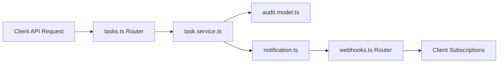

# Practical 3.3: Multi-File Orchestration with Cursor Composer / Agent

**Module**: Module 3 - Cursor Orientation  
**Level**: Associate / Graduate Trainee  
**Duration**: 45 Minutes  
**Core Technical Competencies**: Multi-File Agent Execution (`Cmd/Ctrl+I`), Step-by-Step Task Decomposition, Cross-Layer Dependency Synchronization, Multi-File Diff Scrubbing, Test-Driven Verification.

---

## 1. Engineering Context & Problem Specification

Real-world features rarely touch a single file. Adding an enterprise capability requires changes across:
- Data Models & Types (`src/core/models/`)
- Persistence & Storage (`src/core/database/`)
- Business Domain Logic & Event Publishing (`src/core/services/`)
- API Route Handlers & Serialization (`src/api/routes/`)
- Automated Unit & Integration Tests (`tests/unit/`, `tests/integration/`)

Using inline edit or single-file chat for multi-file features causes drift, broken imports, and inconsistent type definitions. Cursor's **Composer / Agent Mode** (`Cmd/Ctrl+I`) allows developers to orchestrate synchronized changes across multiple files from a single intent prompt.

---

## 2. Feature Specification: "Audit Trail & Webhook Subsystem"

Trainees must direct Cursor Agent to implement an end-to-end Audit & Webhook notification system:



### Coordinated Requirements:
1. **Model Layer (`src/core/models/audit.model.ts`)**:
   - Define `AuditAction` enum (`TASK_CREATED`, `TASK_UPDATED`, `TASK_DELETED`, `STATUS_CHANGED`).
   - Define `AuditRecord` interface with `id`, `task_id`, `action`, `actor`, `timestamp`, and `changes` payload.
2. **Service Layer (`src/core/services/task.service.ts` & `notification.ts`)**:
   - Whenever a task is created, updated, or status changes, emit an audit event to the notification service.
3. **API Routing Layer (`src/api/routes/webhooks.ts`)**:
   - Create router with `POST /webhooks/subscribe` and `GET /webhooks/subscriptions`.
   - Register route in `src/api/server.ts`.
4. **Test Suite (`tests/unit/webhook.spec.ts`)**:
   - Create Jest/Vitest unit tests validating webhook subscription and event dispatching.

---

## 3. Trainee Workflow

1. Open Cursor Composer in **Agent Mode** (`Cmd/Ctrl+I`).
2. Provide explicit context markers: `@src/core/ @src/api/ @docs/architecture.md`.
3. Construct a Structured Multi-Step Master Prompt.
4. **Scrubbing the Multi-File Diff**:
   - Do NOT click "Accept All" blindly.
   - Inspect each file in the Composer queue.
   - Verify that Composer did NOT alter unrelated database configurations in `src/core/database/client.ts`.
5. Run the test suite:
   ```bash
   npm test
   ```

---

## 4. Evaluation Rubric

| Assessment Dimension | Weight | Target Standard |
| :--- | :---: | :--- |
| **Agent Prompt Decomposition** | 30% | Clear step-by-step numbering, explicit file targets, and architectural boundary constraints. |
| **Cross-File Type Consistency** | 25% | Shared types (`AuditAction`, `AuditRecord`) import correctly across models, services, and routes without `any`. |
| **Diff Review Rigor** | 25% | Rejected unnecessary changes to untouched files (`client.ts`, `server.ts` global config). |
| **Automated Test Validation** | 20% | `npm test` passes cleanly with both positive and negative test cases. |
